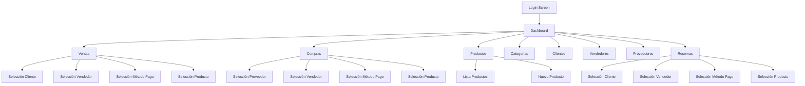

# BodegaGemma - Sistema Venta

Sistema de gestión integral para control de ventas, inventario y operaciones comerciales de Bodega Gemma.

## 📋 Descripción del Proyecto

BodegaGemma - Sistema Venta es una aplicación móvil desarrollada en Flutter que permite gestionar de manera eficiente las operaciones comerciales de una bodega. El sistema proporciona funcionalidades completas para el control de inventario, registro de ventas, compras, reservas y gestión de clientes y proveedores.

## 🚀 Tecnologías Utilizadas

### Framework y Lenguaje Principal
- **Flutter**: Framework de desarrollo multiplataforma de Google
- **Dart**: Lenguaje de programación utilizado para el desarrollo de la aplicación

### Arquitectura del Proyecto
- **Arquitectura MVC**: Modelo-Vista-Controlador para una mejor organización del código
- **Patrón de diseño basado en servicios**: Separación de lógica de negocio en servicios independientes

### Dependencias Principales
- `http`: Para la comunicación con APIs REST
- `provider`: Manejo de estado de la aplicación
- `intl`: Internacionalización y formato de fechas
- `flutter_bloc`: Manejo avanzado de estado con el patrón BLoC
- `rxdart`: Extensiones reactivas para Dart

### Plataformas Soportadas
- Android
- Linux (Escritorio)
- Web

## 🏗️ Estructura del Proyecto

```
lib/
├── models/                 # Modelos de datos de la aplicación
├── screen/
│   ├── login_screen.dart   # Pantalla de autenticación
│   ├── pages/              # Páginas principales de la aplicación
│   │   ├── account/        # Gestión de cuenta
│   │   ├── category/       # Gestión de categorías
│   │   ├── client/         # Gestión de clientes
│   │   ├── product/        # Gestión de productos
│   │   ├── purchase/       # Gestión de compras
│   │   ├── reservation/    # Gestión de reservas
│   │   ├── sale/           # Gestión de ventas
│   │   ├── seller/         # Gestión de vendedores
│   │   └── supplier/       # Gestión de proveedores
│   ├── sidebar/            # Componentes de navegación lateral
│   └── dashboard.dart      # Panel principal de control
├── services/               # Servicios para comunicación con el backend
└── config.dart             # Configuración global de la aplicación
```

## 📊 Modelos de Datos

La aplicación utiliza los siguientes modelos de datos principales:

- **Category**: Gestión de categorías de productos
- **Client**: Información de clientes
- **PaymentMethod**: Métodos de pago disponibles
- **Product**: Información detallada de productos
- **Purchase/PurchaseDetail**: Registro de compras y detalles
- **Reservation/ReservationDetail**: Sistema de reservas
- **Sale/SaleDetail**: Registro de ventas y detalles
- **Seller**: Información de vendedores
- **Supplier**: Información de proveedores

## 🔧 Funcionalidades Principales

### Autenticación
- Sistema de login seguro para vendedores
- Validación de credenciales contra API backend

### Dashboard
- Vista general de estadísticas:
  - Número de ventas y compras
  - Conteo de clientes y vendedores
  - Estado de productos y categorías
  - Información de proveedores y reservas

### Gestión de Inventario
- **Productos**: Alta, baja, modificación y consulta
- **Categorías**: Organización de productos por categorías
- Control de stock y alertas de bajo inventario
- Seguimiento de fechas de expiración

### Ventas
- Registro completo de transacciones de venta
- Selección de cliente, vendedor y método de pago
- Detalle de productos vendidos con cantidades y precios
- Historial de ventas

### Compras
- Registro de adquisiciones de productos
- Asociación con proveedores
- Detalle de productos comprados
- Historial de compras

### Reservas
- Sistema de reservas de productos
- Asociación con clientes
- Seguimiento de estado de reservas

### Gestión de Usuarios
- **Clientes**: Registro y mantenimiento de información
- **Vendedores**: Gestión de personal autorizado
- **Proveedores**: Base de datos de proveedores

## 🌐 Integración con Backend

La aplicación se conecta a un backend mediante una API RESTful alojada en:
```
https://humble-disco-j6xq574qp6php954-8080.app.github.dev/sistventas/api/v1
```

Los servicios implementan todas las operaciones CRUD necesarias para cada entidad del sistema.

## 📱 Diagrama de Navegación



## ⚙️ Configuración del Proyecto

### Requisitos Previos
- Flutter SDK 3.4.0 o superior
- Dart SDK 3.4.0 o superior
- Android Studio o VS Code con plugins de Flutter/Dart
- Dispositivo físico o emulador para pruebas

### Instalación

1. Clonar el repositorio:
```bash
git clone <repository-url>
```

2. Instalar dependencias:
```bash
flutter pub get
```

3. Ejecutar la aplicación:
```bash
flutter run
```

## 📦 Empaquetado y Distribución

La aplicación puede ser compilada para diferentes plataformas:

### Android
```bash
flutter build apk
```

### Web
```bash
flutter build web
```

### Linux (Desktop)
```bash
flutter build linux
```

## 🛡️ Seguridad

- Autenticación basada en credenciales de vendedor
- Comunicación segura con el backend mediante HTTPS
- Validación de datos en frontend y backend
- Protección contra accesos no autorizados

## 📈 Futuras Mejoras

- Implementación de sistema de reportes avanzados
- Notificaciones push para alertas de inventario
- Integración con sistemas de pago digitales
- Sincronización offline con sincronización posterior
- Mejora en la experiencia de usuario con animaciones

## 👥 Equipo de Desarrollo

Aplicación desarrollada como parte del proyecto académico AS231S4_T12_AppMovil.
- Erick Portuguez
- Johan Malasquez
- Maylin Jauregui